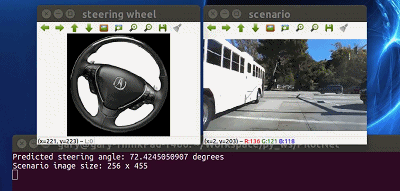

# _PilotNet_: End to End Learning for Self-Driving Cars
<p align="center">
   
</p>

　　A TensorFlow implementation of this Nvidia's [End to End Learning for Self-Driving Cars](https://arxiv.org/pdf/1604.07316.pdf) with some changes. And implement [Explaining How a Deep Neural Network Trained with End-to-End Learning Steers a Car](https://arxiv.org/abs/1704.07911).
```latex
@article{bojarski2016end,
  title={End to end learning for self-driving cars},
  author={Bojarski, Mariusz and Del Testa, Davide and Dworakowski, Daniel and Firner, Bernhard and Flepp, Beat and Goyal, Prasoon and Jackel, Lawrence D and Monfort, Mathew and Muller, Urs and Zhang, Jiakai and others},
  journal={arXiv preprint arXiv:1604.07316},
  year={2016}
}

@article{bojarski2017explaining,
  title={Explaining how a deep neural network trained with end-to-end learning steers a car},
  author={Bojarski, Mariusz and Yeres, Philip and Choromanska, Anna and Choromanski, Krzysztof and Firner, Bernhard and Jackel, Lawrence and Muller, Urs},
  journal={arXiv preprint arXiv:1704.07911},
  year={2017}
}
```

# How to Use
The instructions are tested on Ubuntu 16.04 with python 2.7 and tensorflow 1.0 with GPU support (CUDA 8.0 and cuDNN 5.1).

## Installation
- Clone the PilotNet repository:
   ```bash
   $ git clone https://github.com/Durant35/PilotNet.git
   ```
   We name the root directory as `$ROOT`.

- Setup virtual environment using `virtualenvwrapper`.
   ```shell
   $ pip install virtualenvwrapper
   # configure virtualenvwrapper
   $ mkdir $HOME/.local/virtualenvs
   
   # append contents in `~/.bashrc`
   $ sudo vim ~/.bashrc
   
   # always use pip/distribute
   export VIRTUALENV_USE_DISTRIBUTE=1
   # directory to store all virtual environment 
   export WORKON_HOME=$HOME/.local/virtualenvs
   if [ -e $HOME/.local/bin/virtualenvwrapper.sh ]; then
     source $HOME/.local/bin/virtualenvwrapper.sh
   else if [ -e /usr/local/bin/virtualenvwrapper.sh ]; then
     source /usr/local/bin/virtualenvwrapper.sh
   fi
   export PIP_VIRTUALENV_BASE=$WORKON_HOME
   export PIP_RESPECT_VIRTUALENV=true
   
   # enable virtualenvwrapper
   $ source ~/.bashrc
   # create virtual environment with python2.7 and tensorflow 1.0.0
   $ mkvirtualenv -p /usr/bin/python2.7 python1.0.0
   ```
- Use pip to install required Python packages:
   ```Shell
   $ cd $ROOT
   $ workon python1.0.0
   (python1.0.0) $ pip install -r requirements.txt
   ```

## Demo
+ Download the [dataset](https://drive.google.com/file/d/0B-KJCaaF7elleG1RbzVPZWV4Tlk/view?usp=sharing) and extract into the dataset folder [`./data/dataset_nvidia/`](./data/dataset_nvidia/).
   ```bash
   $ cd $ROOT/data/dataset_nvidia/
   wget -t https://drive.google.com/file/d/0B-KJCaaF7elleG1RbzVPZWV4Tlk/view?usp=sharing
   unzip driving_dataset.zip -d .
   ```

+ Run the model on the dataset.
   ```bash
   $ workon python1.0.0
   (python1.0.0) $ python ./src/run_dataset.py
   ```
+ [option] Use `python run.py` to run the model on a live webcam feed


Use `python train.py` to train the model

To visualize training using Tensorboard use `tensorboard --logdir=./logs`, then open http://0.0.0.0:6006/ into your web browser.
