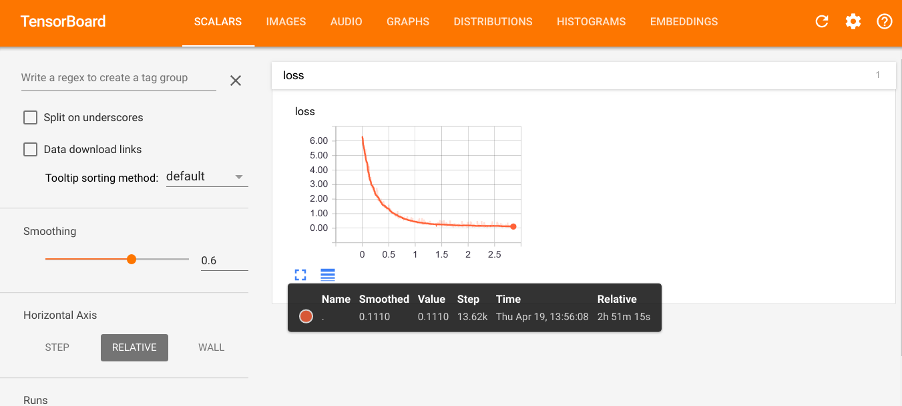

# _PilotNet_: End to End Learning for Self-Driving Cars
<p align="center">
   
</p>

　　A TensorFlow implementation of this Nvidia's 
[End to End Learning for Self-Driving Cars](https://arxiv.org/pdf/1604.07316.pdf) with some changes. And implement
[Explaining How a Deep Neural Network Trained with End-to-End Learning Steers a Car](https://arxiv.org/abs/1704.07911).
```latex
@article{bojarski2016end,
  title={End to end learning for self-driving cars},
  author={Bojarski, Mariusz and Del Testa, Davide and Dworakowski, Daniel and Firner, Bernhard and Flepp, Beat and Goyal, Prasoon and Jackel, Lawrence D and Monfort, Mathew and Muller, Urs and Zhang, Jiakai and others},
  journal={arXiv preprint arXiv:1604.07316},
  year={2016}
}

@article{bojarski2017explaining,
  title={Explaining how a deep neural network trained with end-to-end learning steers a car},
  author={Bojarski, Mariusz and Yeres, Philip and Choromanska, Anna and Choromanski, Krzysztof and Firner, Bernhard and Jackel, Lawrence and Muller, Urs},
  journal={arXiv preprint arXiv:1704.07911},
  year={2017}
}
```

# How to Use
The instructions are tested on Ubuntu 16.04 with python 2.7 and tensorflow 1.0 with GPU support (CUDA 8.0 and cuDNN 5.1).

## Installation
- Clone the PilotNet repository:
   ```bash
   $ git clone https://github.com/Durant35/PilotNet.git
   ```
   We name the root directory as `$ROOT`.

- Setup virtual environment using `virtualenvwrapper`.
   ```shell
   $ pip install virtualenvwrapper
   # configure virtualenvwrapper
   $ mkdir $HOME/.local/virtualenvs
   
   # append contents in `~/.bashrc`
   $ sudo vim ~/.bashrc
   
   # always use pip/distribute
   export VIRTUALENV_USE_DISTRIBUTE=1
   # directory to store all virtual environment 
   export WORKON_HOME=$HOME/.local/virtualenvs
   if [ -e $HOME/.local/bin/virtualenvwrapper.sh ]; then
     source $HOME/.local/bin/virtualenvwrapper.sh
   else if [ -e /usr/local/bin/virtualenvwrapper.sh ]; then
     source /usr/local/bin/virtualenvwrapper.sh
   fi
   export PIP_VIRTUALENV_BASE=$WORKON_HOME
   export PIP_RESPECT_VIRTUALENV=true
   
   # enable virtualenvwrapper
   $ source ~/.bashrc
   # create virtual environment with python2.7 and tensorflow 1.0.0
   $ mkvirtualenv -p /usr/bin/python2.7 python1.0.0
   ```
- Use pip to install required Python packages:
   ```Shell
   $ cd $ROOT
   $ workon python1.0.0
   (python1.0.0) $ pip install -r requirements.txt
   ```

## Dataset
　If you want to run the demo on the dataset or try some training works, download the
[driving_dataset.zip](https://drive.google.com/file/d/0B-KJCaaF7elleG1RbzVPZWV4Tlk/view?usp=sharing) and recommend you to
extract into the dataset folder [`./data/dataset_nvidia/`](./data/dataset_nvidia/).
```bash
$ cd $ROOT/data/dataset_nvidia/
$ wget -t https://drive.google.com/file/d/0B-KJCaaF7elleG1RbzVPZWV4Tlk/view?usp=sharing
$ unzip driving_dataset.zip -d .
```

　This [driving_dataset.zip](https://drive.google.com/file/d/0B-KJCaaF7elleG1RbzVPZWV4Tlk/view?usp=sharing) consists of
**images of the road ahead (`*.jpg`)** and recorded **steering wheel angles (`%.6f`)**, `data.txt` should in following
format:
```yaml
    ...
98.jpg 2.120000
99.jpg 2.120000
100.jpg 2.120000
101.jpg 2.120000
    ...
```

## Demo
　You can run this demo directly on a live webcam feed in actual running scenario (**online**) or just **offline**, given input
images of the road ahead.

+ Run the model on the dataset.
   ```bash
   $ cd $ROOT
   $ workon python1.0.0
   (python1.0.0) $ ./scripts/demo.sh -h
   Usage: ./scripts/demo.sh [options]
    
   options:
   -h, --help                show brief help
   -model_file               model files for restoring PilotNet, default './data/model_nvidia/model.ckpt'
   -online                   run the demo on a live webcam feed, default demo on dataset
   -dataset_dir              dataset given input images of the road ahead, default './data/dataset_nvidia'
   (python1.0.0) $ ./scripts/demo.sh
   ```
+ Run the model on a live webcam feed
   ```bash
   $ cd $ROOT
   $ workon python1.0.0
   (python1.0.0) $ ./scripts/demo.sh -online
   ```

## Training/Validation
+ After downloading the dataset, you can train your own model parameters as following:
   ```bash
   $ cd $ROOT
   $ workon python1.0.0
   (python1.0.0) $ ./scripts/train.sh -h
   Usage: ./scripts/train.sh [options]
    
   options:
   -h, --help         show brief help
   -dataset_dir       training dataset given input images of the road ahead and
                        recorded steering wheel angles, default './data/datasets/driving_dataset'
   -f                 force to clear old logs if exist
   -log_dir           path for training logs, including training summaries as well as model parameters,
                        default in './logs' and './logs/checkpoint' respectively
   -num_epochs        the numbers of epochs for training, default train over the dataset about 30 times.
   -batch_size        the numbers of training examples present in a single batch for every training, default 128
   (python1.0.0) $ ./scripts/train.sh
   ```
   + You can run `./scripts/train.sh` to train your model from downloaded dataset following tips above. Training logs and 
   model will be stored into [./logs](./logs) and [./logs/checkpoint](./logs/checkpoint) respectively.
   + `-dataset_dir` can help you to specify other available dataset.
   + You can use `-log_dir` to set another log directory, and be careful to use `-f` for log files synchronization,
   fix `WARNING:tensorflow:Found more than one metagraph event per run. Overwriting the metagraph with the newest event.`
   + You can use `-num_epochs` and `-batch_size` to control the training step if good at it.

<hr/>
<p align="center">
   
</p>

+ Use **Tensorboard** to visualize training, then open [http://127.0.1.1:6006](http://127.0.1.1:6006) in your web browser, 
following figure shows the step-by-step training of given model in [./data/models/model.ckpt](./data/models) as well as
log files in [./logs](./logs/).
   ```bash
   $ cd $ROOT
   $ workon python1.0.0
   (python1.0.0) $ tensorboard --logdir=./logs
   I tensorflow/stream_executor/dso_loader.cc:135] successfully opened CUDA library libcublas.so.8.0 locally
   I tensorflow/stream_executor/dso_loader.cc:135] successfully opened CUDA library libcudnn.so.5 locally
   I tensorflow/stream_executor/dso_loader.cc:135] successfully opened CUDA library libcufft.so.8.0 locally
   I tensorflow/stream_executor/dso_loader.cc:135] successfully opened CUDA library libcuda.so.1 locally
   I tensorflow/stream_executor/dso_loader.cc:135] successfully opened CUDA library libcurand.so.8.0 locally
   Starting TensorBoard 41 on port 6006
   (You can navigate to http://127.0.1.1:6006)
   ```